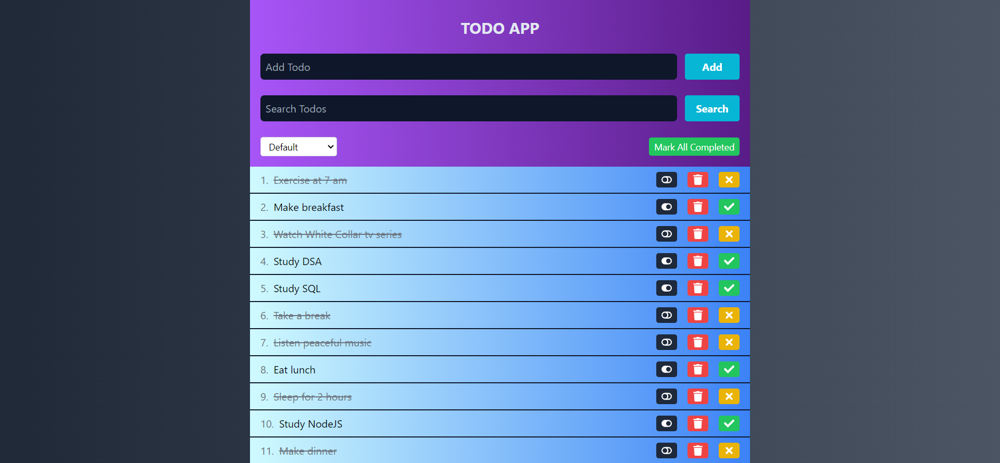

<h1 align="center" id="title">TODO APP</h1>

<h4> This is a simple Todo application built using React, Tailwind CSS, and Redux, and bootstrapped with Vite. It allows users to add tasks, mark them as completed or incomplete, filter tasks based on their completion status, delete tasks, and mark all tasks as completed.</h4>

## 🖥️ Tech Stack

<p align="left">

&nbsp;&nbsp;
&nbsp;&nbsp;
&nbsp;&nbsp;


<h2>Deployed On:</h2>
<p></p>


<h2>🚀 Demo</h2>

[https://todo-app-sand-theta-17.vercel.app](https://todo-app-sand-theta-17.vercel.app)

<h2>Project Snapshot:</h2>


<h2>⚡️ Features</h2>

- Add new tasks
- Mark tasks as completed or incomplete
- Filter tasks based on completion status (Completed, Incompleted, Default)
- Delete tasks
- Mark all tasks as completed

## Technologies Used

- React
- Tailwind CSS
- Redux

## Installation

### Clone the repository:

```bash
git clone https://github.com/your-username/todo-app.git
```

### Navigate to the project directory:
```bash
cd todo-app
```

### Install dependencies:
```shell
npm install
```

### Start the app
```shell
npm run dev
```
